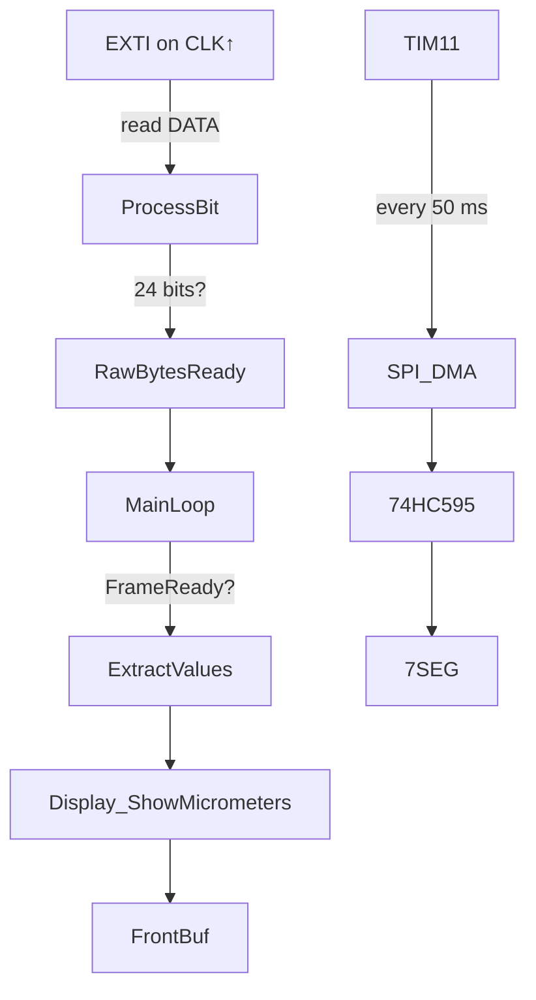

# STM32 + Digital Caliper Reader

This document explains **how the project works**, the **serial protocol** used by the Shahe‑class digital caliper, and how the firmware captures, decodes and displays the measurement.

---

## 1  Hardware overview
| block | details |
|-------|---------|
| **MCU** | STM32F401RE @ 22.184 MHz (CubeIDE / HAL) |
| **Caliper** | Shahe/Guanglu compatible, 24‑bit single‑frame output |
| **Wiring** | `CAL_CLK` → PA0 (EXTI), `CAL_DATA` → PA1, both pulled‑up (≈47 kΩ) |
| **Display** | 6‑digit 7‑segment; 2 × 74HC595 driven by SPI2 + DMA + latch (PB12) |

```
Caliper ── CLK ─┐                STM32F401
                └─ PA0  ➜ EXTI (rising)
Caliper ── DATA ──── PA1  ➜ GPIO read
```

---

## 2  Caliper serial protocol
| feature | value |
|---------|-------|
| frame rate | 125 Hz (one frame every 8 ms) |
| gap between frames | >5 ms (used for resync) |
| line levels | open‑collector, idles HIGH (pull‑up required) |
| bit order | **LSB‑first** (bit 0 transmitted first) |
| clock edge | data valid **while CLK = HIGH**; sample on rising edge |
| frame length | **24 bits** (REL value only) |

### Frame layout (LSB‑first)
```
bit  0 : always 1      ← sanity check
bit  1 : always 0
bits 2‑15  : counter in 0.01 mm   (0‑65535)
bit  16‑19 : always 0
bit  20    : sign (1 = minus)
bit  21‑23 : always 0
```

Example frames (LSB‑first bytes):
```
 05 00 00   → +0.02 mm
 05 00 10   → –0.02 mm   (bit 20 set)
 F4 01 00   → +5.00 mm
 F4 01 10   → –5.00 mm
```

---

## 3  Decoding algorithm
```c
SIGN_MASK = 0x100000      // bit 20
neg   = raw24 & SIGN_MASK;
count = raw24 & 0xFFFF;   // 0.01 mm steps
value_um = count * 10;    // → µm
if (neg) value_um = -value_um;
```

### Why *×10 µm* ?
One counter unit = 0.01 mm → 0.000 01 m = 10 µm.

---

## 4  Firmware flow (simplified)


1. **EXTI ISR** (`HAL_GPIO_EXTI_Callback`)
   * Resets capture if gap > 3 ms.
   * Calls `Caliper_ProcessBit(bit)` once per rising CLK.
2. **caliper.c** collects 24 bits → sets `frame_ready`.
3. **main()** polls `Caliper_FrameReady()`; when true:
   * Converts raw24 → `rel_um` (µm) and toggles status LED.
   * Passes value to display driver.
4. **display7seg.c** keeps a double buffer; TIM11 triggers DMA → SPI → 74HC595 → LED panel.

---

## 5  Accuracy & filtering
* Physical resolution of the sensor is **0.01 mm**. No hidden 1 µm bits exist.
* Optional moving‑average filter (8 frames) can reduce jitter to ≈ ±3 µm.

---

## 6  Porting notes
* Works on any STM32 with EXTI‑capable GPIO and SPI + DMA.
* Change `SIGN_MASK`, bit‑order or `CALIPER_TOTAL_BITS` if you meet another caliper variant.
* Keep all **USER CODE BEGIN/END** blocks: CubeMX regeneration is safe.

---

© 2025 DevMachine / Open source under MIT License

